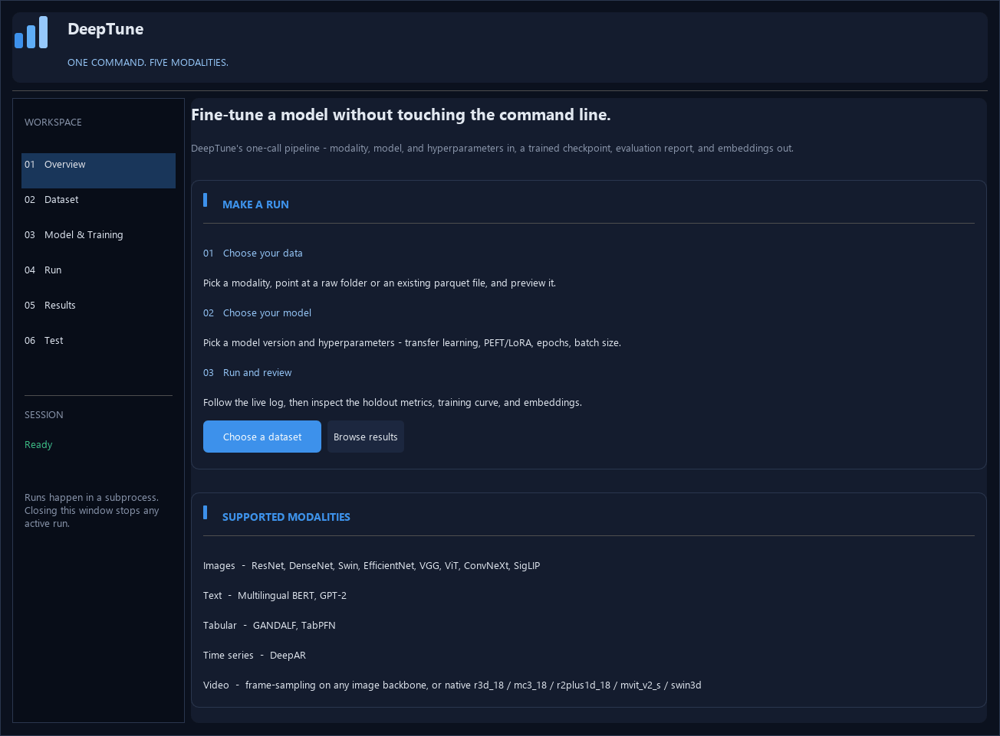

# DeepTune
## **Windows installer:** [https://github.com/ply971/deeptune-installer/releases/latest](https://github.com/ply971/deeptune-installer/releases/latest)

**Train, evaluate, and run inference across images, text, tables, time series, and video.**

[](https://github.com/ply971/deeptune-installer/releases/latest)
[](pyproject.toml)
[](https://github.com/ply971/deeptune-installer/actions/workflows/test.yml)
[](https://deeptune.readthedocs.io/en/latest/)

[Get started](#get-started) · [Video analysis](#video-analysis) · [Desktop guide](desktop/README.md) · [Test & inference](inference/README.md) · [Supported models](#supported-models) · [Build an installer](packaging/README.md)

## Get started

| Use DeepTune | Start here |
| --- | --- |
| **Install on Windows** | Download `DeepTune-Setup-1.1.0.exe` from the [latest release](https://github.com/ply971/deeptune-installer/releases/latest). Python and dependencies are bundled. |
| **Run from source** | Follow the [Desktop GUI setup](#desktop-gui) below using Python 3.12. |
| **Predict on new data** | Use the desktop **Test** page with a saved model. See the [inference guide](inference/README.md). |
| **Develop or package** | See the [verification guide](docs/VERIFICATION.md) and [installer build instructions](packaging/README.md). |

The Windows installer targets **Windows 10/11, 64-bit** and uses CPU-based training. Some models download pretrained weights on first use. See the [installation requirements](packaging/README.md#what-the-installer-needs-from-the-machine-it-installs-on) for details.

## Video analysis

DeepTune learns from labeled video clips and applies the trained model to new videos. It supports **clip classification**, **regression with numeric targets**, and **video embedding extraction**. Predictions describe a clip as a whole; this workflow does not provide object tracking or frame-by-frame event timestamps.

### Analyze videos in the desktop app

1. On **Dataset**, select **Video** and enable **Raw data**.
2. Choose **Select MP4 / video files** to import clips. Preview them with play/pause, seeking, and looping, then assign a class label to each clip and click **Use clip dataset**. You can also load class folders or a CSV/XLSX manifest with `videos` and `labels` columns.
3. Choose a model and training settings, including the number of sampled frames and the pooling method where applicable. Start training from **Run**, then inspect the results and evaluation metrics.
4. Open **Test**, select a saved checkpoint, and choose a new video or video dataset. Run inference to export **`predictions.csv`** with a prediction for each clip and confidence scores for classification. Labels are optional for prediction; when supplied, DeepTune also writes **`inference_metrics.json`**.

Use multiple labeled clips per class so training and validation both contain examples. For regression, provide numeric labels in a video manifest or parquet dataset. Keep the original files at the paths referenced by your saved clip list.

### How the video models work

DeepTune decodes each clip with OpenCV and samples frames uniformly across its duration. It then uses one of two model paths:

| Approach | How it analyzes a clip | Model examples |
| --- | --- | --- |
| **Frame pooling** | A 2D image backbone extracts features from each sampled frame; mean or learned attention pooling combines them into a clip representation. | ResNet, DenseNet, EfficientNet, Swin, ViT, VGG, ConvNeXt |
| **Native video models** | A 3D CNN or video transformer processes the sampled frame sequence to learn appearance and motion together. | `r3d_18`, `mc3_18`, `r2plus1d_18`, `mvit_v2_s`, `swin3d_t`, `swin3d_s`, `swin3d_b` |

Video workflows support parameter-efficient fine-tuning (PEFT) and embedding extraction for downstream analysis. The inline player is muted; model analysis uses visual frames. See the [video import guide](desktop/README.md#import-mp4-videos), [inference coverage](inference/README.md#whats-covered-per-modality), and [recorded verification](docs/VERIFICATION.md) for details.

## Overview


***DeepTune*** is a full compatible library to automate Computer Vision, Natural Language Processing, Tabular, Time Series, and Video state-of-the-art deep learning algorithms for cross-modal applications on image, text, tabular, time series, and video datasets. The library is designed for use in different applied machine learning domains, including but not limited to medical imaging, natural language understanding, time series analysis, providing users with powerful, ready-to-use CLI tool that unlock the full potential of their case studies through just a one simple command.

***DeepTune*** is primarily presented for undergraduate and graduate computer science students community at St. Francis Xavier University (StFX) in Nova Scotia, Canada. We aspire to seeing this software adopted broadly across the computer science research community all over the world.

## DeepTune GUI Demo

Explore the desktop app: **Overview → Video dataset → Clip preview → Model & Training → Test**.

[](https://github.com/ply971/deeptune-installer/blob/main/docs/assets/deeptune-gui-demo.mp4)

**[Watch the GUI demo video (MP4)](https://github.com/ply971/deeptune-installer/blob/main/docs/assets/deeptune-gui-demo.mp4)** · [Desktop guide](desktop/README.md) · [Download the Windows installer](https://github.com/ply971/deeptune-installer/releases/latest)

Captured from the actual desktop app. The preview uses a synthetic motion clip; this interface tour shows the available controls, not a completed training or inference run.

## Desktop GUI

Use Python 3.12 and install the project from its repository root:

```powershell
python -m venv .venv
.venv\Scripts\python.exe -m pip install -e ".[test]"
```

Prefer a graphical interface over the command line? Run:

```powershell
.venv\Scripts\python.exe desktop\app.py
```

to pick a modality and dataset, choose a model and its hyperparameters, launch the run, and browse results, all without typing CLI flags. The desktop app includes saved settings, automatic full logs, bounded background previews, cancellation, and metrics CSV export. See [desktop/README.md](desktop/README.md) for details and repeatable video checks.

The installed commands are `deeptune` and `deeptune-desktop`. Run automated checks
with `.venv\Scripts\python.exe -m pytest tests -q`.

Don't want to set up Python at all? See [packaging/README.md](packaging/README.md)
for building `DeepTune-Setup.exe`, a standalone Windows installer of the desktop
app with every dependency bundled in.

## Features

- Fine-tuning state-of-the-art Computer Vision algorithms (ResNet, DenseNet, etc.) for image classification.
- Fine-tuning state-of-the-art NLP (BERT, GPT-2) algorithms for text classification.
- End-to-end training for tabular and time-series algorithms.
- Fine-tuning video classifiers on raw video clips, either by sampling frames through the existing 2D vision backbones (with pooling over time), or through native spatio-temporal architectures (3D-CNNs and video transformers) that learn motion directly.
- Providing PEFT with LoRA support for Computer Vision and Video algorithms implemented, enabling state-of-the-art models that typically require substantial computational resources to perform efficiently on lower-powered devices. This approach not only reduces computational overhead but also enhances performance.
- Leveraging fine-tuned and pretrained state-of-the-art vision, video, and language models to generate robust knowledge representations for downstream visual, temporal, and textual tasks.
  
## Supported models


<details>
<summary>Expand the full model and capability matrix</summary>

<table>
  <thead>
    <tr>
      <th>Model</th>
      <th>Transfer Learning with Adjustable Embedding Layer?</th>
      <th>Support PEFT with Adjustable Embedding Layer?</th>
      <th>Support Embeddings Extraction?</th>
      <th>Task</th>
      <th>Modality</th>
      <th>Supported Models</th>
    </tr>
  </thead>
  <tbody>
    <tr>
      <td>ResNet</td>
      <td>✅</td>
      <td>✅</td>
      <td>✅</td>
      <td>Classification & Regression</td>
      <td>Image</td>
      <td>'resnet18', 'resnet34', 'resnet50', 'resnet101', or 'resnet152'</td>
    </tr>
    <tr>
      <td>DenseNet</td>
      <td>✅</td>
      <td>✅</td>
      <td>✅</td>
      <td>Classification & Regression</td>
      <td>Image</td>
      <td>'densenet121', 'densenet161', 'densenet169', or 'densenet201'</td>
    </tr>
    <tr>
      <td>Swin</td>
      <td>✅</td>
      <td>✅</td>
      <td>✅</td>
      <td>Classification & Regression</td>
      <td>Image</td>
      <td>'swin_t', 'swin_s', or 'swin_b'</td>
    </tr>
    <tr>
      <td>EfficientNet</td>
      <td>✅</td>
      <td>✅</td>
      <td>✅</td>
      <td>Classification & Regression</td>
      <td>Image</td>
      <td>'efficientnet_b0', 'efficientnet_b1', 'efficientnet_b2', 'efficientnet_b3', 'efficientnet_b4', 'efficientnet_b5', 'efficientnet_b6', or 'efficientnet_b7'</td>
    </tr>
    <tr>
      <td>VGGNet</td>
      <td>✅</td>
      <td>✅</td>
      <td>✅</td>
      <td>Classification & Regression</td>
      <td>Image</td>
      <td>'vgg11', 'vgg13', 'vgg16', or 'vgg19'</td>
    </tr>
    <tr>
      <td>ViT</td>
      <td>✅</td>
      <td>✅</td>
      <td>✅</td>
      <td>Classification & Regression</td>
      <td>Image</td>
      <td>'vit_b_16', 'vit_b_32', 'vit_l_16', 'vit_l_32' or 'vit_h_14'</td>
    </tr>
    <tr>
      <td>SiGLiP</td>
      <td>✅</td>
      <td>✅</td>
      <td>✅</td>
      <td>Classification</td>
      <td>Image</td>
      <td>'siglip'</td>
    </tr>
    <tr>
      <td>Frame-Pooling Video</td>
      <td>✅</td>
      <td>✅</td>
      <td>✅</td>
      <td>Classification & Regression</td>
      <td>Video</td>
      <td>Any of the ResNet/DenseNet/Swin/EfficientNet/VGGNet/ViT/ConvNeXt versions above, applied frame-by-frame and pooled over time (mean or attention)</td>
    </tr>
    <tr>
      <td>Native Video (3D-CNN / Video Transformer)</td>
      <td>✅</td>
      <td>✅</td>
      <td>✅</td>
      <td>Classification & Regression</td>
      <td>Video</td>
      <td>'r3d_18', 'mc3_18', 'r2plus1d_18', 'mvit_v2_s', 'swin3d_t', 'swin3d_s', or 'swin3d_b'</td>
    </tr>
    <tr>
      <td>GPT</td>
      <td>✅</td>
      <td>—</td>
      <td>✅</td>
      <td>Text Classification</td>
      <td>Text</td>
      <td>GPT-2</td>
    </tr>
    <tr>
      <td>BERT</td>
      <td>✅</td>
      <td>✅</td>
      <td>✅</td>
      <td>Sentiment Analysis</td>
      <td>Text</td>
      <td>bert-base-multilingual-cased</td>
    </tr>
<tr>
  <td>GANDALF</td>
  <td colspan="2" style="text-align:center; font-weight:bold; font-size:16px;">Supports End-to-End Conventional Training</td>
  <td>✅</td>
  <td>Classification & Regression</td>
  <td>Tabular</td>
  <td>GANDALF</td>
</tr>
  <tr>
  <td>TabPFN</td>
  <td colspan="2" style="text-align:center; font-weight:bold; font-size:16px;">Supports Both Fine-tuning & Conventional End-to-End Training</td>
  <td>✅</td>
  <td>Classification & Regression</td>
  <td>Tabular</td>
  <td>tabpfn</td>
</tr>
<tr>
  <td>DeepAR</td>
  <td colspan="2" style="text-align:center; font-weight:bold; font-size:16px;">Supports Conventional End-to-End Training</td>
  <td>✅</td>
  <td>Time Series Forecasting</td>
  <td>Time Series</td>
  <td>DeepAR</td>
</tr>
</tbody>
</table>

</details>

## Documentation

DeepTune is being under active development and mainteneance with a user-friendly comprehensive documentation for easier usage. The documentation can be accessed [here](https://deeptune.readthedocs.io/en/latest/).

## Acknowledgments
This software package was developed as part of work done at Medical Imaging Bioinformatics lab under the supervision of Jacob Levman at St. Francis Xavier Univeristy (StFX), Nova Scotia, Canada.

Thanks to Xuchen for providing their parameter-efficient fine-tuned Swin implementation [SwinTransformerWithPEFT](https://github.com/XuchenGuo/SwinTransformerWithPEFT)

## Citation

If you find *DeepTune* useful, please give us a star ⭐ on GitHub for support.

Also if you find this repository helpful, please cite it as follows:

```bibtex
@software{DeepTune,
author  = {Moayadeldin Hussain, John Kendall and Jacob Levman},
title   = {DeepTune: Cutting-edge Tool automating state-of-the-art deep learning models for cross-modal applications},
year = {2025},
url = {https://github.com/moayadeldin/deeptune},
version = {1.1.0}
}
```
